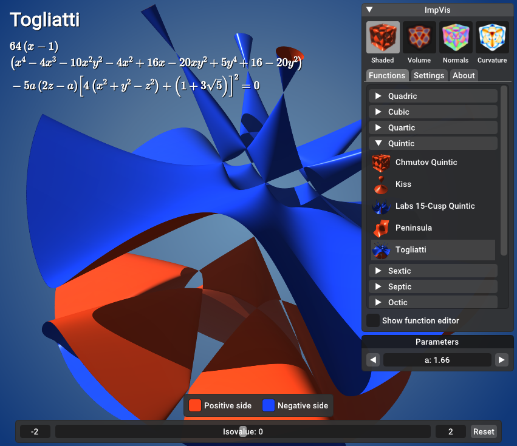
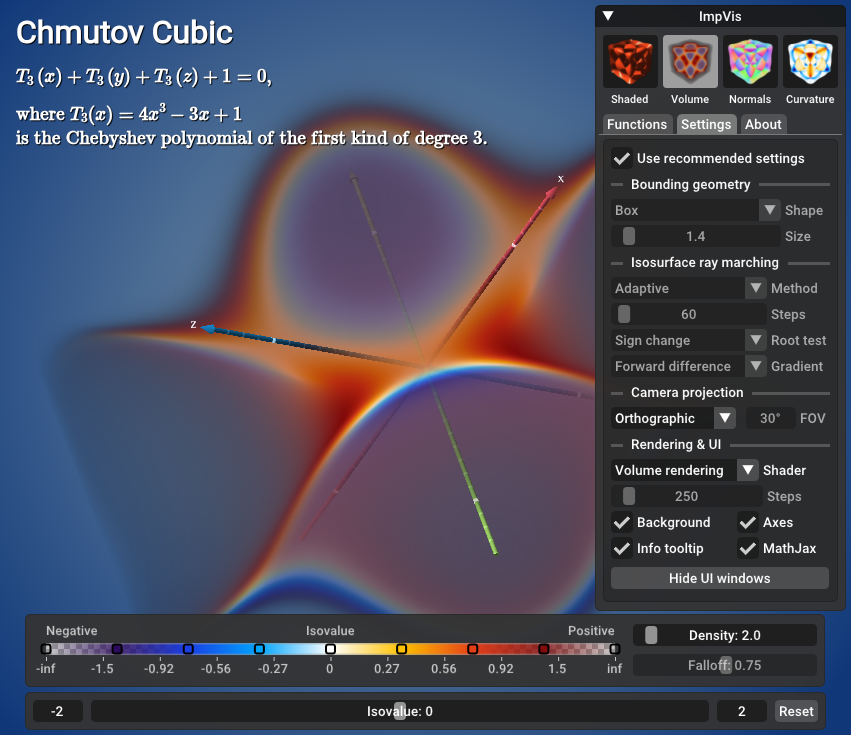
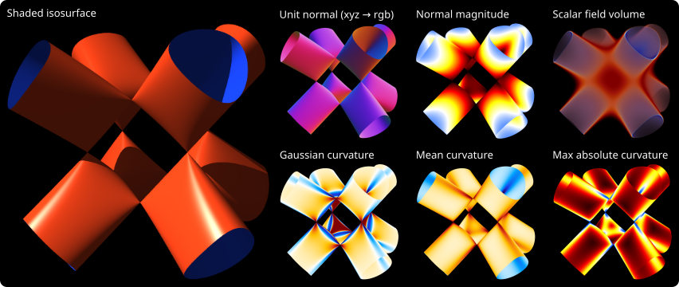

# ImpVis - 3D Implicit Function Viewer

[](https://github.com/hbatagelo/impvis/actions/workflows/build.yml)
[](https://www.codacy.com/gh/hbatagelo/impvis/dashboard?utm_source=github.com\&utm_medium=referral\&utm_content=hbatagelo/impvis\&utm_campaign=Badge_Grade)
[](https://github.com/hbatagelo/impvis/blob/main/LICENSE)

ImpVis is a real-time tool for interactive visualization of 3D implicit
functions, featuring isosurface and volume rendering, live editing, and
differential geometry inspection.

## [Live Demo](https://hbatagelo.github.io/impvis/public/)

## Key Features

- Real-time isosurface and direct volume rendering
- Live parameter and expression editing
- Inspection of surface and volume properties
- Extensive catalog of algebraic, semialgebraic, and non-algebraic functions
- Cross-platform (Linux, Windows, macOS, WebAssembly)

## Screenshots

Below is a screenshot showing the rendering of a quintic surface known as the
[Togliatti surface](https://en.wikipedia.org/wiki/Togliatti_surface). In this
visualization mode, the isosurface is color-coded based on the sign of
$f(x,y,z)-\textrm{isovalue}$.



ImpVis also includes a volume rendering mode for visualizing scalar fields,
shown below for a cubic [Chmutov](https://mathworld.wolfram.com/ChmutovSurface.html)
function. The color and opacity transfer function is a hyperbolic tangent that
maps values greater than the selected isovalue to warm colors (yellow/red),
values less than the selected isovalue to cold colors (blue/purple), and values
near the selected isovalue to white. The colormap, the density (absorption
coefficient), and sigmoid falloff parameters can be fine-tuned.



Surface normals and curvatures can also be visualized as colors. The screenshot
below shows the Gaussian curvature of the
[Chair surface](https://mathworld.wolfram.com/ChairSurface.html). In the
default colormap, parabolic regions are shown in white, saddle regions in cold
colors, and elliptic regions in warm colors.


Below is a [Tetrahedroid](https://mathworld.wolfram.com/Tetrahedroid.html)
visualized using several rendering modes supported by ImpVis:



## Basic Usage

- Drag to rotate the surface (left mouse button) or light source (right mouse
  button).
- Use the mouse wheel to scale the view.
- Hover the cursor on the rendering to inspect surface/volume properties.
- Press F11 to toggle fullscreen.
- Use the top-right window to select a function, change the function parameters
  and adjust the render settings.

## Function Editor

Functions can be created or modified using a built-in editor, which can be
toggled via the "Show function editor" checkbox in the "Functions" tab. The
syntax for writing function expressions is similar to that used in numerical
computing software such as MATLAB and Octave. For example, the left-hand side
of the torus equation,

$$
\left(c-\sqrt{x^2+y^2}\right)^2+z^2-a^2=0,
$$

can be written as `(c-sqrt(x^2+y^2))^2+z^2-a^2`.

The letters `c` and `a` are automatically treated as free parameters that can
be tweaked using sliders below the main window. In general, identifiers that do
not match `x`, `y`, or `z`, built-in math functions (`sqrt`, `abs`, `max`,
etc.), or GLSL variable names (see
[Mixing with GLSL Code](#mixing-with-glsl-code)) are treated as free scalar
parameters.

For better readability, square brackets can be used for grouping in the same
way as parentheses. For example, for the Cassini quartic surface implicit
equation

$$
\left[(x+r)^2+y^2\right]\left[(x-r)^2+y^2\right]-z^2=0,
$$

the left-hand side expression can be written as
`[(x+r)^2+y^2]*[(x-r)^2+y^2]-z^2`.

Any changes to the currently selected function are automatically saved as a
function in the "User-defined" function group.

### Expression Syntax

Function expressions use a modified
[GLSL ES 3.00](https://registry.khronos.org/OpenGL/specs/es/3.0/GLSL_ES_Specification_3.00.pdf)
syntax. As shown in the previous examples, the caret symbol `^` is interpreted
as an exponentiation operator rather than the bitwise exclusive OR defined in
GLSL, and square brackets are used for grouping. Otherwise, plain GLSL syntax
is also supported. Thus, the expression for the torus can be written as
`(c-sqrt(x^2+y^2))^2+z^2-a^2`, but also as `pow(c-sqrt(x*x+y*y),2.0)+z*z-a*a`.

Under the hood, exponentiation expressions of the form `b^n`, where `n` is an
integer from 2 to 16, are converted to a sequence of `n` multiplications:
`b*b*...*b`. ImpVis also has custom built-in functions `mpow2(b)`, `mpow3(b)`,
up to `mpow16(b)`, that can be used in place of `b^2`, `b^3`, ..., `b^16`.

### Mixing with GLSL Code

The function editor allows embedding custom GLSL ES code both in the global and
local scope of the shader function that evaluates the implicit function. Try
selecting different functions from the catalog to see how they use embedded
GLSL code. As a rule of thumb:

- Use the global scope to define GLSL functions and constants to be used either
  in the local scope or directly in the function expression.
- Use the local scope to define GLSL variables to be used in the function
  expression.

Additionally:

- In the local scope, `p` is a `vec3` GLSL variable containing the
  surface/volume point at which the function is evaluated. `x`, `y`, and `z`
  are aliases to `p.x`, `p.y`, and `p.z`.
- `uIsoValue` is the current isovalue.
- The functions `mpow2(b)`, `mpow3(b)`, up to `mpow16(b)`, are also available
  in the global and local scope.

## How It Works

Isosurfaces are rendered using an adaptive ray marching algorithm.
Scalar fields are rendered using direct volume rendering. Both are implemented
as GLSL ES 3.00 shaders. Function names and expressions displayed in the
top-left corner are rendered using [MathJax](https://www.mathjax.org/)
(available in the WebAssembly build only).

The adaptive ray marching algorithm adjusts the size of the ray's next step
according to the scalar field value and its gradient evaluated at the current
sample point. The step size decreases as the ray approaches the surface, and
increases as it moves away from it. This is conceptually similar to the
*adaptive marching points* algorithm described in
[Real-Time Ray Tracing of Implicit Surfaces on the GPU](https://ieeexplore.ieee.org/document/4815235)
(Singh et al. 2009). However, in ImpVis the step size varies gradually as the
rays approach the surface, thus reducing the number of conditional branchings.
In addition, the step size decreases as the ray approaches the boundary of the
bounding volume to reduce clipping artifacts at these regions. For details, see
the inline comments in the fragment shader at `src/assets/shaders/raycast.frag`.

## Building

ImpVis can be built for the desktop (Windows, Linux, macOS) and the web
(WebAssembly).

First clone the repo:

```sh
git clone https://github.com/hbatagelo/impvis.git
cd impvis
```

Ensure the following tools are installed and are reachable from `PATH`:

- [Conan](https://conan.io/) ≥ 2.0.
- [CMake](https://cmake.org/) ≥ 3.24.
- A C++ compiler with support for C++20.

### Building for the Desktop

1. Run `conan install` to resolve dependencies and prepare the project for
   build:
    <details>
    <summary>Linux</summary>

    ```sh
    conan install . --output-folder=build --build=missing -c tools.system.package_manager:mode=install -c tools.system.package_manager:sudo=True
    ```

    </details>

    <details>
    <summary>macOS</summary>

    ```sh
    conan install . --output-folder=build --build=missing
    ```

    </details>

    <details>
    <summary>Windows</summary>

    ```sh
    conan install . --output-folder=build --build=missing -s compiler.cppstd=20
    ```

    </details>
2. Run `conan build` to build the project:

   ```sh
   conan build .
   ```

### Building for the Web

1. Install [Emscripten](https://emscripten.org/) and activate its environment
   variables.
2. Run `build-wasm.bat` (Windows) or `build-wasm.sh` (Linux, macOS). The
   WebAssembly binaries are written to `impvis/public/`.
3. To test locally, start a local web server with `runweb.bat` (Windows) or
   `runweb.sh` (Linux, macOS), then open <http://localhost:8080/>.

The following parameters can be added to the URL:
| Parameter           | Value  | Description                              |
| :------------------ | :----- | :--------------------------------------- |
| `function`          | string | Name of the function to select at launch |
| `no_axes`           | -      | Hide the coordinate axes                 |
| `no_bkgnd`          | -      | Use a transparent background             |
| `no_ui`             | -      | Hide the UI                              |
| `no_mathjax`        | -      | Hide the function name and equation      |

For example, [`https://hbatagelo.github.io/impvis/public/?no_bkgnd&no_ui&no_mathjax&function=barth%20decic`](https://hbatagelo.github.io/impvis/public/?no_bkgnd\&no_ui\&no_mathjax\&function=barth%20decic)
displays the "Barth Decic" surface with a transparent background, no UI
controls, and no MathJax rendering of the function name and equation.

The URL parameters are useful when embedding the application in iframes, as
shown in the
[ImpVis Sample Gallery](https://hbatagelo.github.io/impvis/public/embedded.html)
and as follows:

```html
<iframe src="https://hbatagelo.github.io/impvis/public/?no_bkgnd&no_ui&no_mathjax&function=barth%20decic"
    style="width: 100%; max-width: 600px; aspect-ratio: 1; margin: 20px auto; display: block; border: none; border-radius: 8px;">
</iframe>
```

## Running Tests

### Unit Testing

1. Run `conan install` as shown in
   [Building for the Desktop](#building-for-the-desktop).

2. ```sh
   cmake --preset conan-release -DENABLE_UNIT_TESTING=ON
   ```

3. ```sh
   cmake --build --preset conan-release
   ```

4. In the build directory, run `tests`.

### Fuzz Testing

Fuzzing is supported via [libFuzzer](https://llvm.org/docs/LibFuzzer.html),
which is included with Clang.

1. Run `conan install` as shown in
[Building for the Desktop](#building-for-the-desktop). Ensure Clang is used as
the compiler, as libFuzzer is Clang-only.

2. ```sh
   cmake --preset conan-release -DENABLE_FUZZ_TESTING=ON
   ```

3. ```sh
   cmake --build --preset conan-release
   ```

4. Copy the resulting executable (`fuzzer`) to `tests/fuzzer` and run:

   ```sh
   ./fuzzer corpus -dict=dictionary.txt -max_len=1280 -timeout=5
   ```

   This will use the corpus of sample inputs contained in `tests/fuzzer/corpus`,
   and the dictionary of keywords in `tests/fuzzer/dictionary.txt`. During the
   fuzzing process, test cases that trigger coverage of new paths through the
   code are added to the corpus directory.

   By default, the fuzzer runs indefinitely or until it finds a bug. Use the
   parameter `-max_total_time` to set a time limit. For example,
   `-max_total_time=60` forces the test to stop after one minute.

## Function Catalog File Format

The implicit functions are described as [TOML](https://toml.io) files located
in `src/assets/functions`.

Each TOML file must have a `title` key at the root level with a value that is
the name of the function group (e.g., `title="Cubic"` for the file that
contains cubic functions). Each function is then described by a table with the
following key/value pairs, of which only the `expression` key/value pair is
required:

| Key                             | Value type      | Description                                                                                             |
| :------------------------------ | :-------------- | :------------------------------------------------------------------------------------------------------ |
| `name`                          | string          | Function name                                                                                           |
| `expression`                    | string          | Expression at the left-hand side of the 3D implicit equation                                            |
| `thumbnail`                     | string          | Path to the thumbnail file, relative to `/src/assets`                                                   |
| `parameters`                    | array of tables | Expression parameters (*see details below*)                                                             |
| `code_local`                    | string          | GLSL code to be embedded into the local scope (see [Function Editor](#function-editor))                 |
| `code_global`                   | string          | GLSL code to be embedded into the global scope (see [Function Editor](#function-editor))                |
| `comment`                       | string          | Comments in LaTeX math mode                                                                             |
| `bounds_shape`                  | string          | Bounding shape: `sphere` (default) or `box`                                                             |
| `bounds_radius`                 | float           | Bounding radius                                                                                         |
| `isosurface_raymarch_method`    | string          | Ray march method for isosurfaces: `adaptive` (default) or `fixed-step`                                  |
| `isosurface_raymarch_steps`     | integer         | Number of ray march steps for isosurfaces if method is `fixed-step`, or maximum number if `adaptive`    |
| `isosurface_raymarch_root_test` | string          | Ray march root test: `sign change` (default), `taylor 1st-order`, `taylor 2nd-order`                    |
| `isosurface_raymarch_gradient`  | string          | Gradient evaluation method: `forward difference` (default), `central difference`, `5-point stencil`     |
| `scale`                         | float           | Surface/volume scaling factor                                                                           |
| `dvr_raymarch_steps`            | integer         | Maximum number of ray march steps for direct volume rendering                                           |
| `dvr_falloff`                   | float           | Sigmoid falloff for direct volume rendering mapping, clamped to the range $[10^{-5}, 100]$              |
| `gaussian_curvature_falloff`    | float           | Sigmoid falloff for color mapping Gaussian curvature, clamped to the range $[10^{-2}, 250]$             |
| `mean_curvature_falloff`        | float           | Sigmoid falloff for color mapping mean curvature, clamped to the range $[10^{-2}, 250]$                 |
| `max_abs_curvature_falloff`     | float           | Sigmoid falloff for color mapping the maximum absolute curvature, clamped to the range $[10^{-2}, 250]$ |
| `normal_length_falloff`         | float           | Sigmoid falloff for color mapping surface normal magnitude, clamped to the range $[10^{-4}, 10]$        |

Each inline table of the `parameters`' array must have two key/value pairs:

| Key     | Value type | Description     |
| :------ | :--------- | :-------------- |
| `name`  | string     | Parameter name  |
| `value` | number     | Parameter value |

Below is an excerpt from `01_quartic.toml`. Browse `src/assets/functions` for
more examples.

```toml
title = "Quartic"

[bifolia]
name = "Bifolia"
thumbnail = "textures/thumbs/quartic/bifolia.png"
bounds_radius = 1.5
isosurface_raymarch_steps = 80
scale = 1.4
dvr_raymarch_steps = 200
dvr_falloff = 7.0
gaussian_curvature_falloff = 0.25
mean_curvature_falloff = 0.25
max_abs_curvature_falloff = 0.075
normal_length_falloff = 0.9
expression = "(x^2+y^2+z^2)^2-3*y*(x^2+z^2)"

[cassini]
name = "Cassini"
thumbnail = "textures/thumbs/quartic/cassini.png"
bounds_radius = 3
isosurface_raymarch_steps = 110
isosurface_raymarch_root_test = "taylor 2nd-order"
scale = 0.8
dvr_raymarch_steps = 200
dvr_falloff = 0.75
gaussian_curvature_falloff = 0.05
mean_curvature_falloff = 0.2
max_abs_curvature_falloff = 0.1
normal_length_falloff = 0.03
parameters = [{name = "r", value = 1}]
expression = "[(x+r)^2+y^2]*[(x-r)^2+y^2]-z^4"

[chair]
name = "Chair"
thumbnail = "textures/thumbs/quartic/chair.png"
bounds_radius = 1.5
isosurface_raymarch_steps = 100
scale = 1.5
dvr_raymarch_steps = 300
dvr_falloff = 8.0
gaussian_curvature_falloff = 0.075
mean_curvature_falloff = 0.075
max_abs_curvature_falloff = 0.025
parameters = [{name = "a", value = 0.95},
              {name = "b", value = 0.8},
              {name = "k", value = 1}]
expression = "(x^2+y^2+z^2-a*k^2)^2-b*[(z-k)^2-2*x^2]*[(z+k)^2-2*y^2]"

[chmutov_quartic]
name = "Chmutov Quartic"
thumbnail = "textures/thumbs/quartic/chmutov_quartic.png"
bounds_shape = "box"
bounds_radius = 1.2
isosurface_raymarch_steps = 100
scale = 1.4
dvr_raymarch_steps = 300
dvr_falloff = 0.75
gaussian_curvature_falloff = 0.075
mean_curvature_falloff = 1.0
max_abs_curvature_falloff = 0.2
normal_length_falloff = 0.07
code_global = '''
float T_4(float x) {
  float x2=x*x;
  float x4=x2*x2;
  return 8.*x4-8.*x2+1.;
}
'''
comment = '''
\mathrm{where}\; T_4(x)=8x^4-8x^2+1\\
&\mathrm{is\;the\;Chebyshev\;polynomial\;of\;the\;first\;kind\;of\;degree\;4.}
'''
expression = "T_4(x)+T_4(y)+T_4(z)"
```

## License

This software is released under the [MIT License](LICENSE).

See [ATTRIBUTIONS.md](ATTRIBUTIONS.md) for attribution information.

## Development History

ImpVis began in 2014 as a Qt-based GPLv3 project available
[here](http://professor.ufabc.edu.br/~harlen.batagelo/impvis/). The current
version is a complete rewrite, now MIT-licensed and built on the
[ABCg](https://github.com/hbatagelo/abcg) framework.