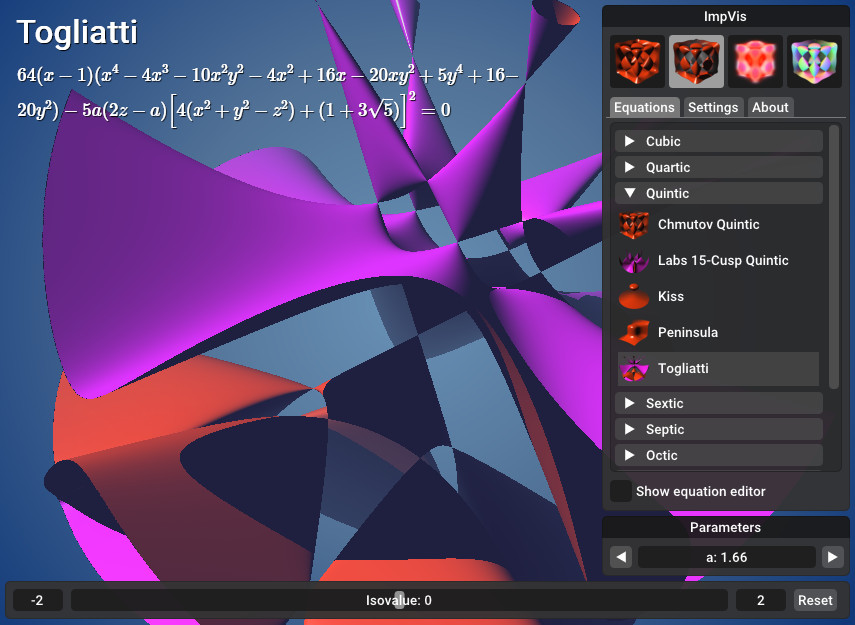
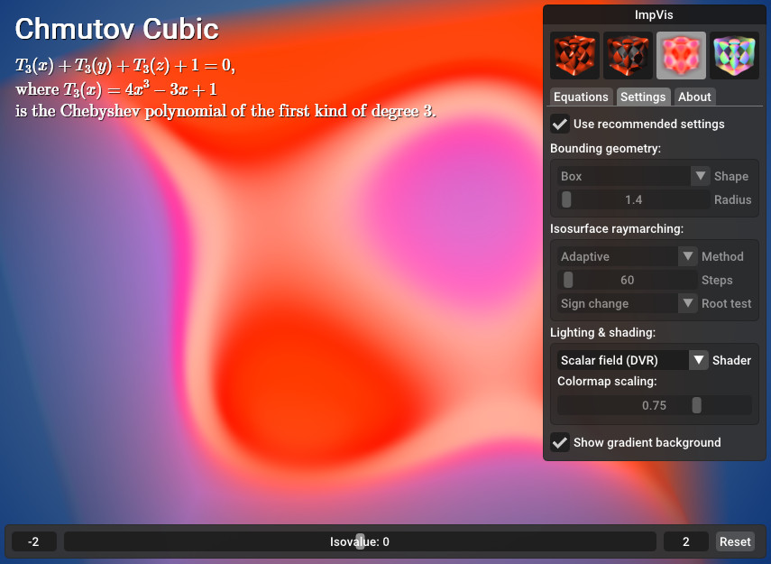

[](https://www.codacy.com/gh/hbatagelo/impvis/dashboard?utm_source=github.com\&utm_medium=referral\&utm_content=hbatagelo/impvis\&utm_campaign=Badge_Grade)
[](https://github.com/hbatagelo/impvis/blob/main/LICENSE)

# ImpVis - 3D Implicit Function Viewer

ImpVis is a real-time visualization tool for displaying isosurfaces and scalar fields of algebraic and non-algebraic 3D implicit functions. The application focuses on interactivity, allowing users to change the function parameters and expressions on the fly.

## [Live Demo](https://hbatagelo.github.io/impvis/public/)

Below is a screenshot of ImpVis displaying a quintic surface known as [Togliatti surface](https://en.wikipedia.org/wiki/Togliatti_surface). The positive and negative sides of the surface are shown in red and magenta, respectively.



ImpVis can also render scalar fields using direct volume rendering, as shown below. The color transfer function maps positive values to red/orange hues, negative values to magenta/purple, and values near zero to white. The mapping can be adjusted using an exponential scaling factor.



## Basic usage

*   Drag to rotate the surface (left mouse button) or light source (right mouse button).
*   Use the mouse wheel to zoom in/out.
*   Press F11 to toggle fullscreen.
*   Drag the bottom slider to set the isovalue.
*   Use the top-right window to select an equation, change the function parameters and adjust the render settings.

## Equation editor

ImpVis features an equation editor that allows users to write new expressions by modifying existing ones from a catalog of predefined implicit equations.

In the equation editor, the expression for the left-hand side of the equation is written in a modified GLSL ES syntax in which the caret symbol `^` is used as an **exponentiation operator** instead of **bit-wise exclusive or** operator. For example, for the Torus implicit equation

$$
(c-\sqrt{x^2+y^2})^2+z^2-a^2=0,
$$

the left-hand side expression can be written as `(c-sqrt(x^2+y^2))^2+z^2-a^2` instead of `pow(c-sqrt(x*x+y*y),2.0)+z*z-a*a`, which is also supported.

Under the hood, exponentiation expressions of the form `b^n`, where `n` is a positive integer between 2 and 16 (inclusive), are converted to the product of multiplying `n` bases: `b*b*...*b`. This is often more efficient than using the native `pow` function. ImpVis also has custom built-in functions `mpow2(b)`, `mpow3(b)`, up to `mpow16(b)`, that can be used in place of `b^2`, `b^3`, up to `b^16`, where `b` is an expression that evaluates to `float`.

Another syntax difference from GLSL is the use of square brackets for grouping (as parentheses) instead of array indexing. For example, for the Cassini quartic surface equation

$$
\left\[(x+r)^2+y^2\right]\left\[(x-r)^2+y^2\right]-z^2=0,
$$

the left-hand side expression can be written as `[(x+r)^2+y^2]*[(x-r)^2+y^2]-z^2`.

The editor also allows injecting GLSL ES code both in the global scope of the shader and in the local scope of the shader function that evaluates the implicit function. Try selecting different equations from the catalog to see how their scopes are implemented in the equation editor. As a rule of thumb:

*   Use the global scope to define GLSL functions and constants to be used either in the local scope or directly in the implicit function.
*   Use the local scope to define GLSL variables to be used in the implicit function expression.

Any changes to the currently selected equation (expression, local scope, or global scope) will be saved as a user-defined equation at the end of the group of equations called "Other".

### Remarks

The following applies to code injected in the local scope:

*   `p` is the name of a `vec3` variable containing the values of the `x`, `y`, and `z` variables of the 3D implicit function. Thus, in the local scope, use `p.x`, `p.y`, and `p.z` instead of `x`, `y`, and `z`.
*   `p2` is a shortcut for `p*p`, `p3` is a shortcut for `p*p*p`, and so on up to `p16`. Again, these are often more efficient than `pow(p,n)`. The functions `mpow2(b)`, `mpow3(b)`, up to `mpow16(b)`, are also available in the local scope.

## How it works

Isosurfaces are rendered using an adaptive raymarching algorithm. Scalar fields are rendered using direct volume rendering. Both are implemented as [GLSL ES 3.00](\(https://www.khronos.org/registry/OpenGL/specs/es/3.0/GLSL_ES_Specification_3.00.pdf\)) shaders. Equation names and expressions shown in the top-left corner of the screen are rendered using [MathJax](https://www.mathjax.org/) (available in the WebAssembly build only).

The adaptive raymarching algorithm adjusts the size of the ray's next step according to the value of the scalar field and gradient evaluated at the current step. The step size decreases as the ray approaches the surface, and increases as it moves away from it. This is similar to the *adaptive marching points* algorithm described in [Real-Time Ray Tracing of Implicit Surfaces on the GPU](https://ieeexplore.ieee.org/document/4815235) (Singh et al. 2009). However, in ImpVis the step size varies gradually as the rays approach the surface, thus reducing the number of conditional branchings. In addition, the step size decreases as the ray approaches the limits of the bounding volume as a measure to avoid clipping artifacts. For details, read the inline comments in the fragment shader at `src/assets/shaders/raycast.frag`.

## Building

ImpVis can be built for the desktop (Windows, Linux, macOS) and the web (WebAssembly).

First clone the repo:

```sh
git clone https://github.com/hbatagelo/impvis.git
cd impvis
```

Ensure the following tools are installed and are reachable from path:

*   [Conan](https://conan.io/) 2.0 or later (not required for WebAssembly).
*   [CMake](https://cmake.org/) 3.24 or later.
*   A C++ compiler with at least partial support to C++20 (tested with GCC 11, Clang 13, MSVC 17, and emcc 3.1).

### Building for the desktop

```sh
conan install . --output-folder=build --build=missing
conan build .
```

### Building for the web

1.  Install [Emscripten](https://emscripten.org/) and activate its environment variables.
2.  Run `build-wasm.bat` (Windows) or `build-wasm.sh` (Linux, macOS).

The WASM binaries will be written to `impvis/public`.

## Running tests

### Unit tests

1.  Configure CMake with `-DENABLE_UNIT_TESTING=ON` (default is `OFF`).
2.  Build the project. The executable `tests` will be written to the build directory.
3.  Run `tests`.

### Fuzzing tests

1.  Install [libFuzzer](https://llvm.org/docs/LibFuzzer.html).

2.  Configure CMake with Clang as compiler, and `-DENABLE_FUZZ_TESTING=ON` (default is `OFF`).

3.  Build the project. The executable `fuzzer` will be written to the build directory.

4.  Copy `fuzzer` to `tests/fuzzer` and run:

    ```sh
    ./fuzzer corpus -dict=dictionary.txt -max_len=1280 -timeout=5
    ```

    This will use the corpus of sample inputs contained in `tests/fuzzer/corpus`, and the dictionary of keywords in `tests/fuzzer/dictionary.txt`. During the fuzzing process, test cases that trigger coverage of new paths through the code will be added to the corpus directory.

    By default, the fuzzer runs indefinitely, or until a bug is found. Use the parameter `-max_total_time` to set a time limit. For example, `-max_total_time=60` forces the test to stop after one minute.

## File format of the catalog of equations

The equations are described as [TOML](https://toml.io) files located in `src\assets\equations`.

Each TOML file must have a `title` key in root level with a value that is the name of the equation group (e.g., `title="Cubic"` for the file that contains cubic equations). Each equation is then described by a table with the following key/value pairs, from which only the `expression` key/value pair is required:

| Key                  | Value type             | Description                                                      |
| :------------------- | :--------------------- | :--------------------------------------------------------------- |
| `name`               | string                 | Equation name                                                    |
| `expression`         | string                 | Left-hand side of the equation expression                        |
| `thumbnail`          | string                 | Path to the thumbnail file, relative to `/src/assets`            |
| `bounds_shape`       | integer (`0` or `1`)   | Bounding shape (`0`: sphere, `1`: box)                           |
| `bounds_radius`      | positive float         | Bounding radius                                                  |
| `raymarch_method`    | integer (`0` or `1`)   | Ray marching method (`0`: adaptive, `1`: fixed-step)             |
| `raymarch_steps`     | positive integer       | Maximum number of ray marching steps                             |
| `raymarch_root_test` | integer (`0` or `1`)   | Ray marching root test (`0`: sign change, `1`: Taylor 1st-order) |
| `camera_distance`    | positive float         | Initial distance from camera                                     |
| `colormap_scale`     | positive float         | Colormap scaling factor for direct volume rendering              |
| `parameters`         | array of inline tables | Expression parameters (*see details below*)                      |
| `code_local`         | string                 | GLSL code to be injected in the local scope                      |
| `code_global`        | string                 | GLSL code to be injected in the global scope                     |
| `comment`            | string                 | Comments in LaTeX math mode                                      |

Each inline table of the `parameters`' array must have two key/value pairs:

| Key     | Value type | Description     |
| :------ | :--------- | :-------------- |
| `name`  | string     | Parameter name  |
| `value` | number     | Parameter value |

Below is an excerpt from `01_quartic.toml`. Browse `src\assets\equations` for more examples.

```toml
title = "Quartic"

[bifolia]
name = "Bifolia"
thumbnail = "textures/thumbs/quartic/bifolia.png"
bounds_radius = 2
raymarch_steps = 80
camera_distance = 7
colormap_scale = 7
expression = "(x^2+y^2+z^2)^2-3*y*(x^2+z^2)"

[cassini]
name = "Cassini"
thumbnail = "textures/thumbs/quartic/cassini.png"
bounds_radius = 3
raymarch_steps = 75
camera_distance = 13
colormap_scale = 0.75
parameters = [{name = "r", value = 1}]
expression = "[(x+r)^2+y^2]*[(x-r)^2+y^2]-z^2"

[chair]
name = "Chair"
thumbnail = "textures/thumbs/quartic/chair.png"
bounds_radius = 2
raymarch_steps = 100
camera_distance = 7
colormap_scale = 8
parameters = [{name = "a", value = 0.95},
              {name = "b", value = 0.8},
              {name = "k", value = 1}]
expression = "(x^2+y^2+z^2-a*k^2)^2-b*[(z-k)^2-2*x^2]*[(z+k)^2-2*y^2]"

[chmutov_quartic]
name = "Chmutov Quartic"
thumbnail = "textures/thumbs/quartic/chmutov.png"
bounds_shape = 1
bounds_radius = 1.2
raymarch_steps = 70
camera_distance = 8
colormap_scale = 0.75
code_global = '''
float T_4(float x) {
  float x2=x*x;
  float x4=x2*x2;
  return 8.*x4-8.*x2+1.;
}
'''
comment = '''
,\\&\mathrm{where}\; T_4(x)=8x^4-8x^2+1\\
&\mathrm{is\;the\;Chebyshev\;polynomial\;of\;the\;first\;kind\;of\;degree\;4.}
'''
expression = "T_4(x)+T_4(y)+T_4(z)"
```

## License

MIT License.

## Development history

ImpVis was originally designed in 2014, based on Qt, and licensed under GPLv3. The current version is a complete rewrite of the [first version](http://professor.ufabc.edu.br/~harlen.batagelo/impvis/). It is now available under the MIT license and is based on the [ABCg](https://github.com/hbatagelo/abcg)  framework.
